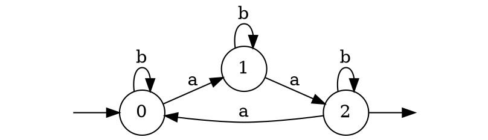

## Définition
Un automate fini déterministe est défini par un quintuplet $A = (\Sigma, Q, q_0, F, \delta)$, où :
- $\Sigma$ est un [[Alphabet|alphabet]]
- $Q$ est un ensemble fini d'états
- $q_0 \in Q$ est l'état initial
- $F \subset Q$ est l'ensemble des états finaux
- $\delta$ est une fonction de $Q \times \Sigma$  dans $Q$, appelée fonction de transition
A est dit complet si $\delta$ est une fonction totale, sinon A est dit partiel.
## Représentation
Un automate fini correspond à un graphe :
- arcs = transitions de l’automate, étiqueté par des symboles de $\Sigma$
- transition = triplet de $Q \times \Sigma \times Q$
- si $\delta (q, a) = r$, on dit que $a$ est l'étiquette de la transition $(q, a, r)$ et que $a$ en est l'origine et $r$ la destination
- noeuds = états de l'automate
- certains noeuds sont distingués comme initial ou finaux

## Exemple
L'automate suivant reconnait le mot $baab$ :

## Equivalence
Deux automates $A_1$ et $A_2$ sont équivalents s'il reconnaissent le même langage.