# Algorithme

L'**algorithme de Baum-Welch** est l'application de l'[[Algorithme d'espérance-maximisation|algorithme d'espérance-maximisation]] à un [[Modèle de Markov caché]] : il estime les [[Paramètres d'un modèle de Markov caché|paramètres]] du modèle à partir d'échantillons d'entraînement, alors que les séquences d'états ne sont pas observées.

1. Partir d'une valeur initiale $\theta_0$ des paramètres.
2. Pour chaque échantillon d'entraînement :
    - (a) calculer les [[Probabilités forward et backward|quantités forward et backward]] $\alpha_i(t)$ et $\beta_i(t)$ ;
    - (b) calculer les statistiques suffisantes $\gamma_t(i)$ et $\xi_t(i, j)$, les [[Statistiques d'occupation d'un état|statistiques d'occupation]] et les [[Statistiques de transition entre deux états|statistiques de transition]].
3. Calculer de nouvelles estimations des paramètres $\theta_{n+1}$.
4. Répéter jusqu'à convergence.

L'étape 2 calcule les espérances par l'[[Calcul des espérances par l'algorithme forward-backward|algorithme forward-backward]] ; c'est l'**étape E** (estimation) de l'algorithme d'espérance-maximisation : elle calcule les quantités espérées dans la [[Fonction auxiliaire de l'algorithme d'espérance-maximisation|fonction auxiliaire]]

$$Q(\theta, \hat{\theta}) = \mathbb{E}[\ln f(\mathbf{z}, \mathbf{x}; \theta) \mid \mathbf{x}; \hat{\theta}],$$

où $f(z, x; \theta)$ est la vraisemblance des données complètes. L'étape 3 réalise la [[Réestimation des paramètres d'un modèle de Markov caché|réestimation des paramètres]] ; c'est l'**étape M** (maximisation) : elle maximise la fonction auxiliaire par rapport aux (vrais) paramètres $\theta$ (sachant les quantités espérées), pour obtenir une nouvelle estimation $\hat{\theta} = \theta_{i+1}$ :

$$\theta_{i+1} = \arg \max_{\theta} Q(\theta, \theta_i).$$

La fonction auxiliaire spécialisée à un modèle de Markov caché est donnée dans [[Fonction auxiliaire de l'espérance-maximisation pour un modèle de Markov caché]].

# Interprétation

L'algorithme compense les données manquantes (ou latentes) (ici les séquences d'états inobservées) en les remplaçant par leurs espérances. Son principe est itératif :

1. estimer les variables manquantes étant donné une estimation courante des paramètres ;
2. estimer de nouveaux paramètres étant donné l'estimation courante des variables manquantes ;
3. répéter les étapes 1 et 2 jusqu'à convergence.

Ce principe s'applique à de nombreux problèmes, pas seulement à l'[[Méthode du maximum de vraisemblance|estimation par maximum de vraisemblance]] des paramètres.

# Exemple

L'algorithme est appliqué en partant d'un modèle à trois états $\lambda_3(\theta_0)$ de paramètres

$$A = \begin{pmatrix} 0.45 & 0.35 & 0.20 \\ 0.10 & 0.50 & 0.40 \\ 0.15 & 0.25 & 0.60 \end{pmatrix}$$

$$B = \begin{pmatrix} 1.0 & 0.0 \\ 0.5 & 0.5 \\ 0.0 & 1.0 \end{pmatrix}$$

$$\pi = \begin{pmatrix} 0.5 \\ 0.3 \\ 0.2 \end{pmatrix}$$

avec un unique échantillon d'entraînement $a\ b\ b\ a\ a$ :

$$\mathbb{P}(a\ b\ b\ a\ a; \lambda_3(\theta_0)) = 0.0278.$$

L'algorithme augmente la vraisemblance des données d'entraînement. Après 1 itération, les paramètres deviennent

$$A = \begin{pmatrix} 0.346 & 0.365 & 0.289 \\ 0.159 & 0.514 & 0.327 \\ 0.377 & 0.259 & 0.364 \end{pmatrix}$$

$$B = \begin{pmatrix} 1.0 & 0.0 \\ 0.631 & 0.369 \\ 0.0 & 1.0 \end{pmatrix}$$

$$\pi = \begin{pmatrix} 0.656 \\ 0.344 \\ 0.0 \end{pmatrix}$$

ce qui donne

$$\mathbb{P}(a\ b\ b\ a\ a; \lambda_3(\theta_1)) = 0.0529.$$

Après 15 itérations, les paramètres deviennent

$$A = \begin{pmatrix} 0.0 & 0.0 & 1.0 \\ 0.212 & 0.788 & 0.0 \\ 0.0 & 0.515 & 0.485 \end{pmatrix}$$

$$B = \begin{pmatrix} 1.0 & 0.0 \\ 0.969 & 0.031 \\ 0.0 & 1.0 \end{pmatrix}$$

$$\pi = \begin{pmatrix} 1.0 \\ 0.0 \\ 0.0 \end{pmatrix}$$

ce qui donne

$$\mathbb{P}(a\ b\ b\ a\ a; \lambda_3(\theta_{15})) = 0.2474.$$

Le diagramme ci-dessous représente les états, les émissions et les transitions de ce modèle (valeurs relevées sur la figure) :

```mermaid
stateDiagram-v2
    state "État 1 (a : 1.0 ; b : 0.0)" as E1
    state "État 2 (a : 0.97 ; b : 0.03)" as E2
    state "État 3 (a : 0.0 ; b : 1.0)" as E3
    [*] --> E1 : 1.0
    E1 --> E3 : 1.0
    E2 --> E1 : 0.212
    E2 --> E2 : 0.788
    E3 --> E2 : 0.515
    E3 --> E3 : 0.485
```

Après 150 itérations, les paramètres deviennent

$$A = \begin{pmatrix} 0.0 & 0.0 & 1.0 \\ 0.18 & 0.82 & 0.0 \\ 0.0 & 0.5 & 0.5 \end{pmatrix}$$

$$B = \begin{pmatrix} 1.0 & 0.0 \\ 1.0 & 0.0 \\ 0.0 & 1.0 \end{pmatrix}$$

$$\pi = \begin{pmatrix} 1.0 \\ 0.0 \\ 0.0 \end{pmatrix}$$

ce qui donne

$$\mathbb{P}(a\ b\ b\ a\ a; \lambda_3(\theta_{150})) = 0.25.$$

Dans le cas d'un modèle initial à cinq états, l'estimation converge vers

$$A = \begin{pmatrix} 0.0 & 1.0 & 0.0 & 0.0 & 0.0 \\ 0.0 & 0.0 & 1.0 & 0.0 & 0.0 \\ 0.0 & 0.0 & 0.0 & 1.0 & 0.0 \\ 0.0 & 0.0 & 0.0 & 0.0 & 1.0 \\ 0.0 & 0.0 & 0.0 & 0.0 & 0.0 \end{pmatrix}$$

$$B = \begin{pmatrix} 1.0 & 0.0 \\ 0.0 & 1.0 \\ 0.0 & 1.0 \\ 1.0 & 0.0 \\ 1.0 & 0.0 \end{pmatrix}$$

$$\pi = \begin{pmatrix} 1.0 \\ 0.0 \\ 0.0 \\ 0.0 \\ 0.0 \end{pmatrix}$$

ce qui donne

$$\mathbb{P}(a\ b\ b\ a\ a; \lambda_5(\pi, A, B)) = 1.0.$$

# Remarque

- L'orthographe usuelle du nom est « Baum-Welch » ; la graphie « Baum-Welsh » est une erreur fréquente, l'algorithme devant son nom à Baum et Welch.
- L'[[Estimation empirique des paramètres d'un modèle de Markov caché|estimation empirique des paramètres]] constitue le point de départ de l'algorithme ; l'[[Algorithme segmental k-means]] en est une alternative.
