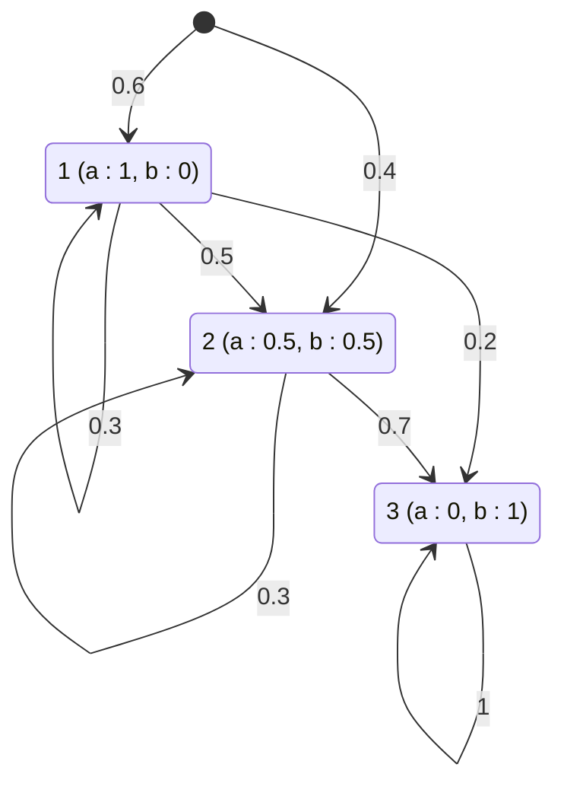

# Algorithme

L'**algorithme forward** calcule les [[Probabilités forward et backward|probabilités forward]] $\alpha_i(t)$ d'un [[Modèle de Markov caché]] de paramètres $\lambda_N(\theta)$. La quantité forward se calcule récursivement selon

$$\mathbb{P}[o_1, \ldots, o_t, S_t = j] = \sum_{i=1}^{N} \mathbb{P}[o_1, \ldots, o_{t-1}, S_{t-1} = i]\,\mathbb{P}[o_t, S_t = j \mid S_{t-1} = i].$$

**Initialisation** ($t = 1$) :

$$\alpha_i(1) = \pi_i b_i(o_1) \quad \forall i \in [1, N].$$

**Récursion** (pour $t = 2, \ldots, T$ et $j = 1, \ldots, N$) :

$$\alpha_j(t) = b_j(o_t) \sum_{i=1}^{N} \alpha_i(t-1) a_{ij}.$$

La somme des quantités forward à l'instant final évalue la probabilité de la séquence d'observations, c'est-à-dire le second des [[Trois problèmes d'un modèle de Markov caché|trois problèmes d'un modèle de Markov caché]] :

$$\mathbb{P}[o_1, \ldots, o_T; \lambda_N(\theta)] = \sum_{i=1}^{N} \alpha_i(T).$$

# Exemple

Soit $\lambda_3 = (A, B, \pi)$ un [[Modèle de Markov caché|modèle]] à 3 états, d'alphabet à 2 symboles $a$ et $b$ :

$$A = \begin{pmatrix} 0.3 & 0.5 & 0.2 \\ 0 & 0.3 & 0.7 \\ 0 & 0 & 1 \end{pmatrix}$$

$$B = \begin{pmatrix} 1 & 0 \\ 0.5 & 0.5 \\ 0 & 1 \end{pmatrix}$$

$$\pi = \begin{pmatrix} 0.6 \\ 0.4 \\ 0 \end{pmatrix}$$

Les états, les transitions et les émissions de ce modèle :

Sur la séquence d'observations $o_1 = a$, $o_2 = a$, les premières quantités forward se calculent pas à pas :

$$\alpha_1(1) = \pi_1 b_1(a) = 0.6 \times 1 = 0.6,$$
$$\alpha_2(1) = \pi_2 b_2(a) = 0.4 \times 0.5 = 0.2,$$
$$\alpha_3(1) = \pi_3 b_3(a) = 0 \times 0 = 0,$$

puis, pour $t = 2$ :

$$\alpha_1(2) = (\alpha_1(1)a_{11} + \alpha_2(1)a_{21} + \alpha_3(1)a_{31})b_1(a)$$
$$= (0.6 \times 0.3 + 0.2 \times 0 + 0 \times 0) \times 1$$
$$= (0.18) \times 1 = 0.18,$$

$$\alpha_2(2) = (\alpha_1(1)a_{12} + \alpha_2(1)a_{22} + \alpha_3(1)a_{32})b_2(a)$$
$$= (0.6 \times 0.5 + 0.2 \times 0.3 + 0 \times 0) \times 0.5$$
$$= (0.36) \times 0.5 = 0.18.$$

Le calcul complet sur la séquence $a\,a\,b\,b$ se lit sur le [[Treillis|treillis]] :

| État | $o_1 = a$ | $o_2 = a$ | $o_3 = b$ | $o_4 = b$ |
|---|---|---|---|---|
| 1 | 0.6 | 0.18 | 0 | 0 |
| 2 | 0.2 | 0.18 | 0.072 | 0.0108 |
| 3 | 0 | 0 | 0.162 | 0.212 |

La somme des quantités de la dernière colonne donne la probabilité de la séquence :

$$\mathbb{P}[o_1, \ldots, o_4; \lambda_3] = 0.212 + 0.0108 = 0.2228.$$

# Remarque

- La probabilité évaluée porte sur la séquence complète : la forme usuelle est $\mathbb{P}[o_1, \ldots, o_T; \lambda_N(\theta)] = \sum_{i=1}^{N} \alpha_i(T)$ ; l'écriture $\mathbb{P}[o_1, \ldots, o_t; \lambda_N(\theta)] = \sum_{i=1}^{N} \alpha_i(T)$, où l'indice $t$ du membre de gauche ne coïncide pas avec l'indice $T$ de la somme, est une erreur fréquente.
- Dans la récursion, chaque terme de la somme est de la forme $\alpha_i(t-1)a_{ij}$ : le calcul de $\alpha_1(2)$ s'écrit $\alpha_1(2) = (\alpha_1(1)a_{11} + \alpha_2(1)a_{21} + \alpha_3(1)a_{31})b_1(a)$ ; omettre le facteur $\alpha_3(1)$ du dernier terme est une erreur fréquente.
- L'équation $(\alpha_1(1)a_{11} + \alpha_2(1)a_{21} + \alpha_3(1)a_{31})b_1(a) = (0.6 \times 0.3 + 0.2 \times 0 + 0 \times 0) \times 1 = 0.18$ est le calcul de $\alpha_1(2)$ ; l'étiqueter $\alpha_3(1)$ est une erreur fréquente, $\alpha_3(1)$ valant $0$.
- L'algorithme forward est le symétrique de l'[[Algorithme backward]] : les deux parcourent le temps en sens inverse l'un de l'autre.
