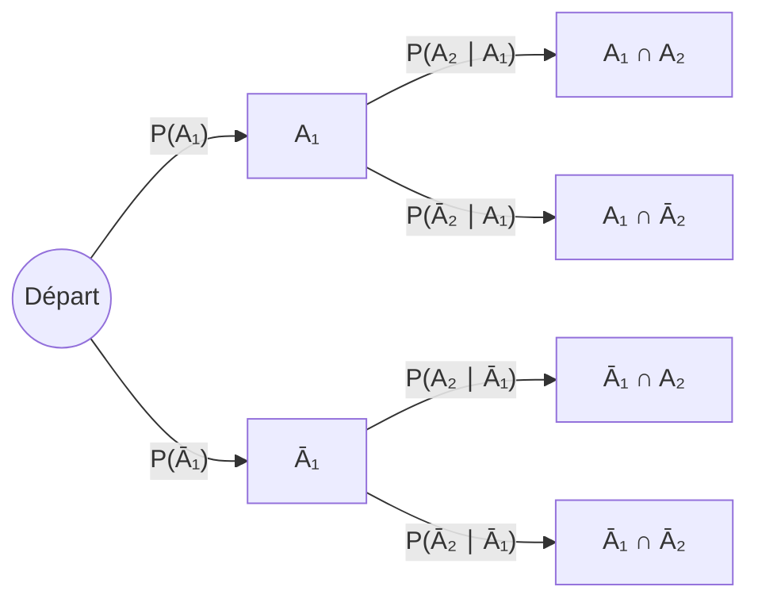
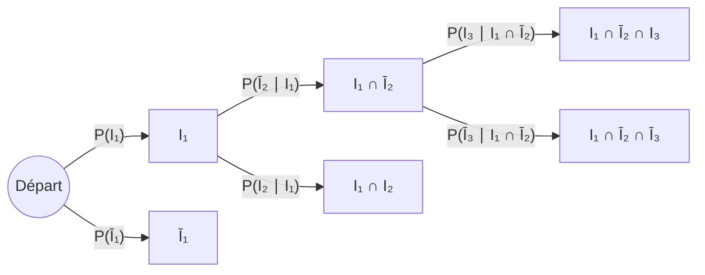

# Définition

Un **arbre de probabilité** est une représentation d'une expérience aléatoire décomposée en une succession d'expériences élémentaires : c'est l'idée de **séquentialité**. Chaque chemin de l'arbre correspond à une succession d'[[Évènement|évènements]] plus simples, c'est-à-dire à l'intersection de ces évènements.

L'arbre se lit du départ vers les feuilles :

Chaque chemin de l'arbre est une succession de branches, chacune portant une probabilité conditionnelle.

# Propriétés

La probabilité d'une intersection d'évènements plus simples se calcule par la [[Probabilités composées|formule des probabilités composées]] :

$$\mathbb{P}(A_1 \cap \dots \cap A_n) = \mathbb{P}(A_1)\,\mathbb{P}(A_2 \mid A_1)\dots\mathbb{P}(A_{n-1} \mid A_1 \cap \dots \cap A_{n-2})\,\mathbb{P}(A_n \mid A_1 \cap \dots \cap A_{n-1})$$

On peut raisonner sur un tel arbre, mais la rédaction nécessite d'utiliser cette formule, et donc de définir en langage naturel les évènements plus simples dont $A$ est l'intersection.

# Interprétation

Cette méthode est à essayer lorsque l'évènement dont on cherche la probabilité est une intersection d'évènements plus simples ; elle aboutit lorsque les [[Probabilité conditionnelle|probabilités conditionnelles]] qui apparaissent sont immédiates à obtenir. Il faut y penser lorsque l'expérience aléatoire se décompose en une succession d'expériences élémentaires.

Bien utilisée, elle permet souvent (mais pas toujours) d'éviter de décrire précisément l'[[Espace probabilisé|espace probabilisé]] et, en conséquence, un dénombrement parfois délicat.

# Exemple

**Tirages avec et sans remise.** On note $A$ l'évènement « tirer alternativement une boule de numéro impair et une boule de numéro pair, en commençant par un numéro impair » et $I_k$ l'évènement auxiliaire « tirer un nombre impair au $k$-ième coup ». Quel que soit l'espace probabilisé $(\Omega, \mathcal{F}, \mathbb{P})$ adapté à cette expérience, on a

$$A = I_1 \cap \overline{I_2} \cap I_3 \cap \overline{I_4} \cap \dots \cap I_{2p-1} \cap \overline{I_{2p}}$$

Le chemin favorable est celui de $A$ : il suit $I_1$, puis $\overline{I_2}$, puis $I_3$, et ainsi de suite.

Ainsi, sans même décrire $(\Omega, \mathcal{F}, \mathbb{P})$, on peut écrire

$$\mathbb{P}(A) = \mathbb{P}(I_1)\mathbb{P}(\overline{I_2} \mid I_1)\mathbb{P}(I_3 \mid I_1 \cap \overline{I_2}) \dots \mathbb{P}(I_{2p-1} \mid I_1 \cap \overline{I_2} \cap \dots \cap \overline{I_{2p-2}})\mathbb{P}(\overline{I_{2p}} \mid I_1 \cap \overline{I_2} \cap \dots \cap I_{2p-1})$$

Si le tirage a lieu **avec remise**, tous ces facteurs sont égaux à $\frac{n}{2n} = \frac{1}{2}$, et l'on retrouve ainsi très simplement $\mathbb{P}(A) = \frac{1}{2^{2p}}$.

Si le tirage a lieu **sans remise**, on trouve

$$\mathbb{P}(A) = \frac{n}{2n}\frac{n}{2n-1}\frac{n-1}{2n-2}\frac{n-1}{2n-3} \cdots \frac{n-(p-1)}{2n-(2p-2)}\frac{n-(p-1)}{2n-(2p-1)}$$

qui est bien la quantité $\frac{(n!)^2}{((n-p)!)^2}\frac{(2n-2p)!}{(2n)!}$ obtenue par modélisation en $(\Omega, \mathcal{F}, \mathbb{P})$ et dénombrement. Cette méthode est plus rapide et plus simple à rédiger.

# Remarque

L'intérêt de la méthode étant d'éviter la description de $\Omega$, on prend tout de même le risque de travailler avec une expérience mal définie (cf. paradoxe de Bertrand) ; dans les cas simples, ce n'est pas gênant.

Pour une décomposition en cas disjoints plutôt qu'en étapes successives, voir la [[Formule des probabilités totales|formule des probabilités totales]].