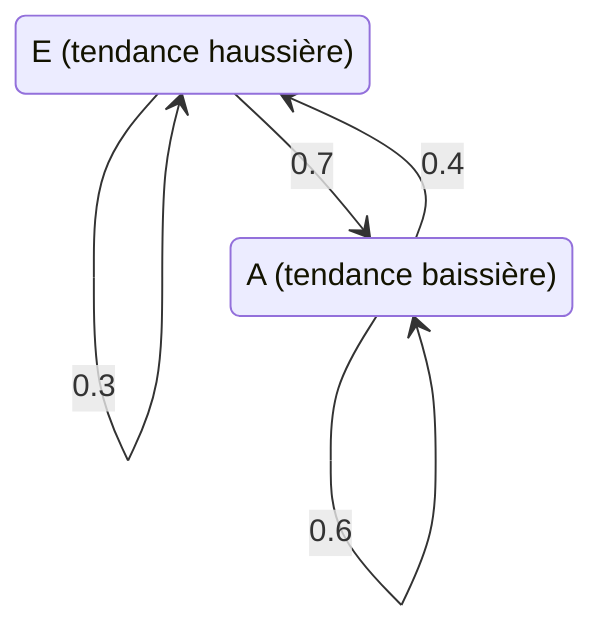
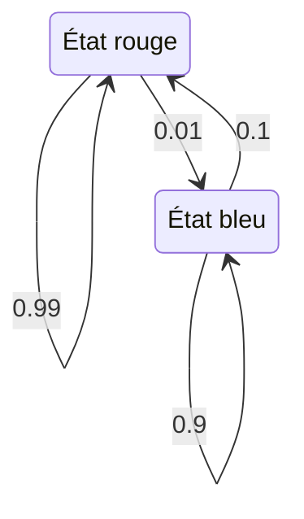
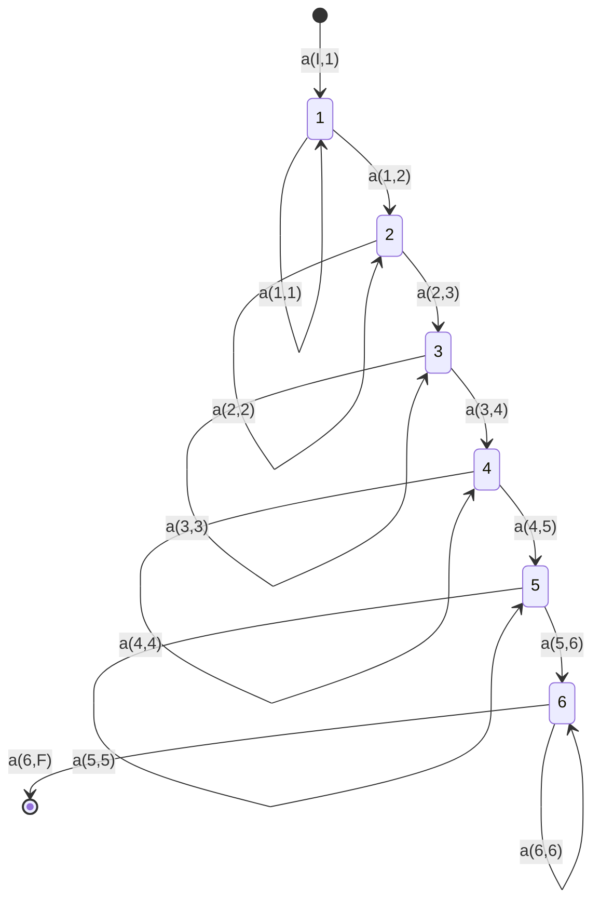

# Interprétation

Les [[Modèle de Markov caché|modèles de Markov cachés]] trouvent des applications dans un grand nombre de domaines, notamment :

- **finance** : analyse de tendances, classification et prévision des marchés boursiers ;
- **traitement du langage naturel** : étiquetage morphosyntaxique, analyse syntaxique, reponctuation ;
- **bioinformatique** : recherche de segments codants, de protéines ;
- **multimédia, parole et image** : reconnaissance de la parole, reconnaissance d'actions, segmentation vidéo ;
- **contrôle et filtrage** : vision par ordinateur, détection de pannes dans les systèmes dynamiques, filtrage de trajectoires.

# Exemple

## Finance : analyse de tendance

Une série financière (comme le cours du dollar contre la livre sterling) alterne des phases de hausse et de baisse qui ne sont pas observées directement : seule la valeur cotée est connue. La tendance joue le rôle d'**état caché**, avec deux valeurs possibles : la tendance haussière, notée $E$, et la tendance baissière, notée $A$. Chaque état émet la valeur observée, et la tendance change d'un pas au suivant selon les probabilités de transition :

La suite des tendances forme une chaîne d'états cachés $X_{n-1}, X_n, \dots$, prenant les valeurs $E$ ou $A$, où chaque état engendre la valeur observée correspondante $Y_{n-1}, Y_n, \dots$.

## Bioinformatique : recherche de segments

Un brin d'ADN est une suite de nucléotides pris parmi A, C, G et T. Pour y repérer des segments d'intérêt, segments codants, protéines, la position est décrite par un état caché qui émet la lettre observée selon sa propre distribution. Deux états suffisent à segmenter la séquence ; leurs transitions sont :

| État caché | A | C | G | T |
|---|---|---|---|---|
| État rouge | 0,4 | 0,1 | 0,1 | 0,4 |
| État bleu | 0,05 | 0,4 | 0,5 | 0,05 |

Les fortes probabilités de rester dans le même état (0,99 et 0,9) font que la suite d'états cachés se lit en longs segments ; les observations, seules visibles, forment par exemple la suite « … A T C A A G G C G A T … ».

## Reconnaissance de la parole

Un signal de parole est un processus **localement stationnaire** : il peut être découpé en zones dont les propriétés statistiques restent à peu près stables. Les vecteurs acoustiques observés, décrits par leurs coefficients $(c_1, c_2)$, se regroupent en amas ; chaque amas correspond à un état d'un modèle d'état, lui-même décrit par un modèle de Markov caché. Dans l'exemple, six amas donnent un modèle à six états enchaînés de gauche à droite :

Les transitions sont notées $a(i,j)$, de l'état $i$ à l'état $j$, avec une entrée $a(I,1)$ et une sortie $a(6,F)$, et chaque état $i$ émet selon une densité $b_i()$. En pratique, cette densité $b()$ est souvent un [[Mélange gaussien|mélange gaussien]] plutôt qu'une simple densité gaussienne.

## Classification de séquences par mots

Pour classer des séquences, le modèle peut être construit **par mots**, sur trois niveaux emboîtés :

- **niveau syntactique** : l'enchaînement des mots est représenté entre deux nœuds reliés par plusieurs transitions parallèles (numérotées 9, 8, …, 1, puis 0) ; les étiquettes « Sildeb » et « Silfin » marquent l'entrée et la sortie ;
- **niveau lexical** : chaque mot est développé en un modèle lexical, chaîne d'états reliés par des transitions ;
- **niveau acoustique** : chaque modèle lexical se réalise en une chaîne d'états élémentaires ($g_1, g_2, \dots, g_{30}$), chacun pouvant revenir sur lui-même.

## Segmentation et classification vidéo

Dans une vidéo, chaque état du modèle représente un **plan** : « 1 état = 1 plan vidéo ». De petits modèles de Markov cachés décrivent la succession typique des plans de différentes séquences, « premier service, échange » (quatre plans), « échange » (deux plans), « rediffusion » (trois plans), « temps morts » (trois plans), les boucles du modèle permettant à un plan de se prolonger.

Pour segmenter la vidéo, la séquence d'observations (les images successives) est décodée par l'[[Algorithme de Viterbi]] : chaque observation reçoit un état, et les groupes d'états consécutifs délimitent les plans. La séquence d'états décodée « 1 2 3 4 | 7 8 7 | 5 6 6 6 6 » marque par exemple « premier service manqué et échange » (états 1 à 4), « rediffusion » (7 8 7) et « échange » (5 6 6 6 6).

# Remarque

Ces applications mettent en œuvre deux des questions traitées pour le [[Modèle de Markov caché|modèle de Markov caché]] : le [[Décodage d'une séquence d'états|décodage de la séquence d'états]] (résolu par l'[[Algorithme de Viterbi]], comme pour la segmentation vidéo) ainsi que le [[Filtrage, lissage et prédiction avec un modèle de Markov caché|filtrage, le lissage et la prédiction]] des états à partir des observations.
