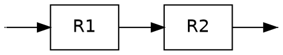
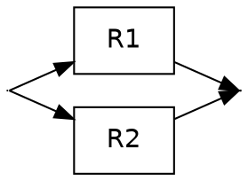
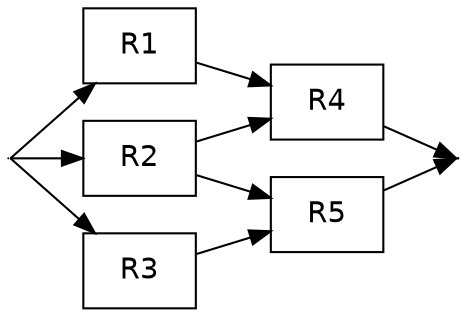

# Définition
La fiabilité d'un composant $i$, notée $R_i$, est la [[Probabilité]] que le composant fonctionne correctement : $R_i = P[A_i]$. On suppose généralement l'[[Indépendance mutuelle]] des pannes des composants.

## Système en série
Le système échoue si **au moins un** de ses composants échoue.
$$ R_s = P[\cap_i A_i] = \prod_i R_i $$

## Système en parallèle
Le système échoue si **tous** ses composants échouent.
$$ R_s = 1 - P[\cap_i \overline{A_i}] = 1 - \prod_i (1 - R_i) $$

## Systèmes complexes (non série/parallèle purs)
On utilise le [[Bayes|Théorème de Bayes]] et la [[Probabilité conditionnelle]] pour calculer la fiabilité globale d'un système qui n'est ni purement en série ni purement en parallèle. 

La méthode consiste à conditionner la réussite globale du système par l'état d'un composant charnière (par exemple, le composant central $R_2$ dans le diagramme ci-dessous) en s'appuyant sur la formule des [[Probabilités totales]].

Si on note $A$ l'événement "le système complet fonctionne", on applique le conditionnement sur l'événement $A_2$ "le composant $R_2$ fonctionne" :
$$ P[A] = P[A|A_2]P[A_2] + P[A|\overline{A_2}]P[\overline{A_2}] $$

*Voir aussi : [[Taux de défaillance et MTTF]]*