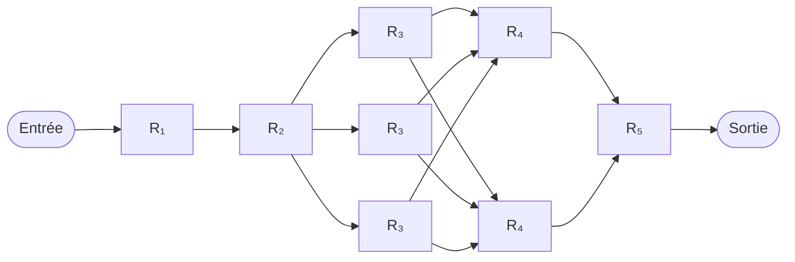
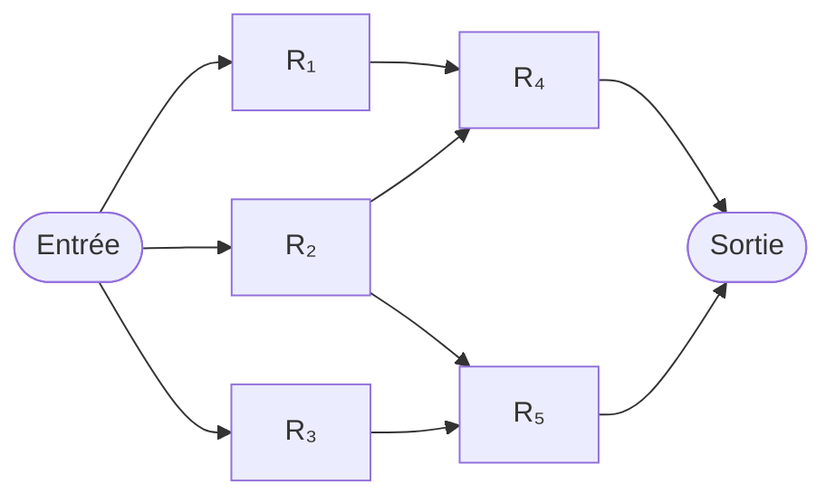

# Définition

Soit un système composé de plusieurs composants connectés. On note $A_i$ l'évènement « le composant $i$ fonctionne correctement » et on appelle **fiabilité** du composant $i$ la probabilité que ce composant fonctionne correctement :

$$R_i = \mathbb{P}[A_i].$$

Pour un composant dont la durée de vie est une variable aléatoire $X$ de [[Fonction de répartition]] $F$, la fiabilité à l'instant $t$ est la probabilité que le composant soit encore en fonctionnement à cet instant :

$$R(t) = \mathbb{P}[X > t] = 1 - F(t).$$

En notant $f$ la densité de la durée de vie :

- $f(t)\Delta t$ est la probabilité **inconditionnelle** de panne dans l'intervalle $[t, t + \Delta t[$ ;
- $h(t) = \frac{f(t)}{R(t)}$ est la [[Probabilité conditionnelle|probabilité conditionnelle]] de panne dans $[t, t + \Delta t[$, sachant que le composant a survécu jusqu'à $t$ ; $h$ est le **taux de panne** ;
- le **temps moyen de panne** (MTTF, *mean time to failure*) est l'[[Espérance d'une variable aléatoire|espérance]] de la durée de vie :

$$\mathbb{E}[X] = \int_0^\infty R(t)\,dt.$$

# Propriétés

**Systèmes en série et en parallèle.** Les défaillances des composants sont supposées **mutuellement indépendantes** ([[Indépendance de variables aléatoires]]).

- Un **système en série** tombe en panne dès que l'un de ses composants tombe en panne ; sa fiabilité est

$$R_s = \mathbb{P}\left[\bigcap_i A_i\right] = \prod_i R_i.$$

- Un **système en parallèle** tombe en panne seulement si tous ses composants tombent en panne ; sa fiabilité est

$$R_s = 1 - \mathbb{P}\left[\bigcap_i \overline{A_i}\right] = 1 - \prod_i (1 - R_i).$$

En utilisant la **défiabilité** $F_i = 1 - R_i$ au lieu de la fiabilité, la relation du système en parallèle s'écrit

$$F_s = \prod_i F_i.$$

**Fiabilité exponentielle.** Si la durée de vie suit une [[Loi exponentielle|loi exponentielle]], alors $R(t) = e^{-ct}$ : le taux de panne est constant, $h(t) = c$, et le temps moyen de panne vaut $c^{-1}$.

Pour un système en série dont les composants ont pour taux de panne $\lambda_i$, la fiabilité est

$$R(t) = \exp\left(-\left(\sum_i \lambda_i\right)t\right),$$

et le temps moyen de panne vaut $\left(\sum_i \lambda_i\right)^{-1}$, qui est inférieur ou égal à $\min_i \mathbb{E}[X_i]$.

# Exemple

**Système combinant série et parallèle.** Les composants 1 et 2 sont en série, suivis de trois composants 3 en parallèle, puis de deux composants 4 en parallèle, et enfin d'un composant 5 en série :

Sa fiabilité est donnée par

$$R_s = R_1 R_2 \left(1 - (1 - R_3)^3\right) \left(1 - (1 - R_4)^2\right) R_5.$$

**Système non parallèle/série.** Trois branches en parallèle (composants 1, 2 et 3) se rejoignent sur les composants 4 et 5 : le composant 1 alimente le composant 4, le composant 2 alimente les composants 4 et 5, et le composant 3 alimente le composant 5.

L'évènement « le système fonctionne » s'écrit

$$A = (A_1 \cap A_4) \cup (A_2 \cap A_4) \cup (A_2 \cap A_5) \cup (A_3 \cap A_5).$$

En conditionnant sur $A_2$ et en appliquant la [[Formule des probabilités totales]],

$$\mathbb{P}[A] = \mathbb{P}[A \mid A_2] \mathbb{P}[A_2] + \mathbb{P}[A \mid \overline{A_2}] \mathbb{P}[\overline{A_2}].$$

Deux cas distincts se présentent :

- si $A_2$ est réalisé, $A_1$ et $A_3$ n'ont pas d'influence et $\mathbb{P}[A \mid A_2]$ se réduit à un système en parallèle ;
- si $\overline{A_2}$ est réalisé, on a deux systèmes en série en parallèle.

La fiabilité du système vaut alors

$$R_s = [1 - (1 - R_4)(1 - R_5)]R_2 + [1 - (1 - R_1R_4)(1 - R_3R_5)](1 - R_2).$$
