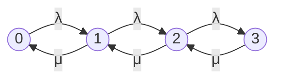

# Définition

La **file $M/M/1$** est l'exemple le plus simple de [[File d'attente|file d'attente]] gouvernée par un [[Processus de naissance et de mort|processus de naissance et de mort]] (PNM). Les temps d'inter-arrivées sont des v.a.i.i.d. de loi commune $\mathcal{E}(\lambda)$, ce qui est équivalent à dire que le processus des arrivées est un [[Processus de Poisson]] de taux $\lambda$ ; les durées de service sont des v.a.i.i.d. de loi commune $\mathcal{E}(\mu)$ ; il y a un seul serveur ; la capacité de la file est infinie ainsi que le nombre de clients potentiels. On admet que le processus $(N(t))_{t \geq 0}$ est une [[Chaîne de Markov à temps continu|CMTCH]], et l'on constate que c'est bien un PNM en calculant les taux de transition.

L'espace des états de ce processus est $\mathbb{N}$, puisque la zone d'attente est illimitée ainsi que le nombre potentiel de clients. La notation $M/M/1$ renvoie à la [[Nomenclature de Kendall]] (deux lois exponentielles et un serveur).

# Interprétation

Le paramètre $\rho = \frac{\lambda}{\mu}$ représente l'**intensité du trafic**. C'est aussi la probabilité qu'il y ait au moins un client dans la file en régime stationnaire, c'est-à-dire la probabilité que le serveur fonctionne : pour cette raison, $\rho$ est également appelé **taux d'activité du serveur**.

Pour qu'un équilibre s'établisse, il est nécessaire que le nombre moyen de clients servis par unité de temps $\mu$ soit plus grand que le nombre moyen d'arrivées par unité de temps $\lambda$ : si $\lambda \geq \mu$, la file s'allonge sans fin et aucun équilibre ne s'établit au cours du temps.

Les paramètres du régime stationnaire (nombre moyen de clients dans le système, temps moyen passé dans le système, temps moyen d'attente, nombre moyen de clients en attente) permettent en pratique de mesurer l'efficacité (ou l'inefficacité) du système ; on souhaite que le temps moyen d'attente et le nombre moyen de clients en attente soient les plus faibles possible.

# Propriétés

## Taux de transition

Pour déterminer les taux de transition, on doit déterminer un D.L. au voisinage de $t = 0$ des $p_{i,j}(t) = \mathbb{P}(N(s+t) = j \mid N(s) = i)$. Pour cela on remarque d'abord que les évènements qui provoquent des transitions ([[Probabilité des évènements provoquant une transition|EPT]]) sont soit des arrivées de clients, soit des fins de service.

- Une arrivée pendant une durée $t$ survient avec une probabilité $\lambda t + o(t)$ (plus précisément, cette probabilité vaut $e^{-\lambda t}\lambda t$ ; en particulier elle ne dépend pas de $s$).
- La probabilité qu'un service commencé à l'instant $s$ soit terminé à l'instant $s+t$ ne dépend pas de $s$ (car la loi $\mathcal{E}(\mu)$ est [[Loi exponentielle|sans mémoire]]) et vaut

$$\mathbb{P}(S_n \leq t) = \int_0^t \mu e^{-\mu x} dx = 1 - e^{-\mu t} = \mu t + o(t)$$

- L'indépendance des $X_n$ entre eux, des $S_n$ entre eux, et des $S_n$ avec les $X_m$ entraîne que la probabilité d'un évènement qui s'écrit comme l'intersection **d'au moins deux** évènements de ce type (arrivée entre $s$ et $s+t$ ou fin de service avant $s+t$) est le produit des probabilités de ces évènements, et est donc négligeable devant $t$ (car au pire de l'ordre de $t^2$).

**Transition de $i$ à $i+1$.** Pour $i \geq 1$, une transition de $i$ à $i+1$ pendant une durée $t$ se produit dans l'éventualité principale : une arrivée entre $s$ et $s+t$ et le serveur (occupé à l'instant $s$, car il y a au moins un client dans la file à cet instant) ne se libère pas pendant cet intervalle de temps. Les autres éventualités sont des intersections d'au moins trois évènements du type arrivée ou fin de service, donc négligeables devant $t$. L'éventualité principale a pour probabilité

$$(\lambda t + o(t))\mathbb{P}(S_n > t) = (\lambda t + o(t)) \int_t^{+\infty} \mu e^{-\mu x} dx = (\lambda t + o(t)) e^{-\mu t} = \lambda t + o(t)$$

Il en résulte que pour $i \geq 1$, $p_{i,i+1}(t) = \lambda t + o(t)$ et donc $a_{i,i+1} = \lambda$. Pour $i = 0$, c'est le même raisonnement en plus simple (car dans l'éventualité principale, le serveur n'est pas occupé), et on trouve donc aussi $p_{0,1}(t) = \lambda t + o(t)$, d'où $a_{0,1} = \lambda$.

On a utilisé le fait qu'un évènement du type « durée de service supérieure à $t$ » a une probabilité égale à $\int_t^{+\infty} \mu e^{-\mu x} dx = e^{-\mu t} \sim 1$ : chaque fois que l'on doit multiplier par la probabilité d'un évènement de ce type, cela ne change rien au D.L.

**Transition de $i$ à $i-1$.** Pour $i \geq 1$, calculons $p_{i,i-1}(t)$. C'est la probabilité qu'il n'y ait pas d'arrivée pendant la durée $t$ et que le serveur occupé se libère pendant ce même intervalle de temps, à laquelle on ajoute des probabilités d'évènements négligeables devant $t$. Donc c'est

$$p_{i,i-1}(t) = e^{-\lambda t}(1 - e^{-\mu t}) + o(t) = \mu t + o(t)$$

Cela prouve $a_{i,i-1} = \mu$.

**Transitions des autres types.** Pour conclure rapidement, calculons $p_{i,i}(t)$ (cette stratégie est motivée par le fait que l'on veut démontrer que le processus est un PNM). Il convient de distinguer le cas $i = 0$. La probabilité $p_{0,0}(t)$ est la probabilité qu'il n'y ait pas d'arrivée pendant la durée $t$, à laquelle s'ajoutent des probabilités négligeables devant $t$. On a donc

$$p_{0,0}(t) = e^{-\lambda t} + o(t) = 1 - \lambda t + o(t)$$

Il en résulte que tous les taux de transition $a_{0,j}$ pour $j \geq 2$ sont nuls. Pour $i \geq 1$, la probabilité $p_{i,i}(t)$ est la probabilité qu'il n'y ait pas d'arrivée pendant la durée $t$ et que le serveur occupé ne se libère pas, à laquelle s'ajoutent des probabilités négligeables devant $t$. On a donc

$$\begin{aligned} p_{i,i}(t) &= e^{-\lambda t}e^{-\mu t} + o(t) \\ &= \left(1 - \lambda t + o(t)\right)\left(1 - \mu t + o(t)\right) \\ &= 1 - \lambda t - \mu t + o(t) \end{aligned}$$

Il en résulte que tous les taux de transition $a_{i,j}$ pour $j \geq i+2$ ou $j \leq i-2$ (lorsque $i \geq 2$) sont nuls.

On a bien prouvé que le processus $(N(t))_{t \geq 0}$ est un PNM, et on a

$$\forall i \in \mathbb{N},\; \lambda(i) = \lambda$$

$$\forall i \in \mathbb{N}^{*},\; \mu(i) = \mu$$

Le graphe des transitions est le suivant :

Chaque état $i$ transite vers $i+1$ au taux $\lambda$ et, pour $i \geq 1$, vers $i-1$ au taux $\mu$ ; le graphe se poursuit ainsi pour tous les états suivants.

## Régime stationnaire

Il suffit d'appliquer la formule de la distribution limite du [[Processus de naissance et de mort|PNM]] avec les valeurs trouvées pour $\lambda(i)$ et $\mu(i)$ : s'il existe un régime stationnaire, on a pour $j \geq 1$

$$\begin{aligned} \pi_j &= \pi_0 \prod_{k=1}^j \frac{\lambda}{\mu} \\ &= \pi_0 \left( \frac{\lambda}{\mu} \right)^j \end{aligned}$$

On détermine $\pi_0$ avec la condition de normalisation $\sum_{j=0}^{+\infty} \pi_j = 1$ :

$$\sum_{j=0}^{+\infty} \pi_j = \pi_0 \left( 1 + \sum_{j=1}^{+\infty} \left( \frac{\lambda}{\mu} \right)^j \right) = 1$$

Cette égalité nous donne également la condition d'existence du régime stationnaire : il existe si et seulement si la série géométrique de raison $\frac{\lambda}{\mu}$ est convergente. Notons

$$\rho = \frac{\lambda}{\mu}$$

Pour qu'il existe un régime stationnaire, il est donc nécessaire et suffisant que $\rho < 1$, ce qui revient à dire que $\lambda < \mu$.

On suppose maintenant $\rho < 1$. On a

$$\pi_0 \sum_{j=0}^{+\infty} \rho^j = 1$$

donc

$$\pi_0 = 1 - \rho$$

On en déduit que $\rho = 1 - \pi_0$ est également la probabilité qu'il y ait au moins un client dans la file en régime stationnaire, c'est-à-dire la probabilité que le serveur fonctionne. Pour cette raison, $\rho$ est également appelé **taux d'activité du serveur**.

Finalement, la loi $\pi = (\pi_0, \pi_1, \pi_2, \dots)$ du nombre de clients dans le système en régime stationnaire est donnée par

$$\forall j \in \mathbb{N} \quad \pi_j = (1 - \rho)\rho^j$$

Il s'agit d'une [[Loi géométrique|loi géométrique]] de paramètre $1 - \rho$, mais supportée par $\mathbb{N}$ (et non par $\mathbb{N}^*$).

## Nombre moyen de clients dans le système

Il s'agit de $\overline{N} = \mathbb{E}(N_\infty)$, l'[[Espérance d'une variable aléatoire|espérance]] de la v.a. $N_\infty$ dont on vient de déterminer la loi $\pi$. On a

$$\begin{aligned}\mathbb{E}(N_\infty) &= \sum_{j \in \mathbb{N}} j \mathbb{P}(N_\infty = j) \\ &= \sum_{j \in \mathbb{N}} j \pi_j \\ &= (1 - \rho) \sum_{j=1}^{+\infty} j \rho^j \\ &= (1 - \rho) \rho \sum_{j=1}^{+\infty} j \rho^{j-1} \\ &= (1 - \rho) \rho \frac{1}{(1 - \rho)^2}\end{aligned}$$

On a utilisé le calcul classique suivant : dériver terme à terme la série géométrique de raison $x$, c'est-à-dire dériver $\frac{1}{1-x}$, puis remplacer $x$ par $\rho$. Finalement on trouve

$$\mathbb{E}(N_\infty) = \frac{\rho}{1-\rho} = \frac{\lambda}{\mu-\lambda}$$

## Temps moyen passé dans le système

Il s'agit de déterminer la quantité notée $\overline{R}$. Comme il y a existence d'un régime stationnaire (on suppose toujours que $\rho < 1$), il y a [[Système ergodique|ergodicité]] et la [[Formule de Little]] s'applique. Il faut donc déterminer $\overline{\lambda}$, taux moyen des arrivées. C'est

$$\begin{aligned} \overline{\lambda} &= \sum_{j \in \mathbb{N}} \lambda(j) \pi_j \\ &= \lambda \sum_{j \in \mathbb{N}} \pi_j \\ &= \lambda \end{aligned}$$

ce qui est logique ; attention toutefois, ce calcul ne donnerait pas $\lambda$ si la file était limitée : c'est le cas par exemple de la file $M/M/1/K$, dont le calcul est fait dans l'étude plus générale de la [[File M-M-n-K|file $M/M/n/K$]].

La formule de Little nous donne $\mathbb{E}(N_\infty) = \overline{\lambda} \times \overline{R}$, donc

$$\overline{R} = \frac{1}{\mu - \lambda}$$

## Temps moyen d'attente

Le temps moyen passé dans le système par un client quelconque (en régime stationnaire) est égal à la somme du temps moyen d'attente et du temps moyen de service. Or, puisque la durée de service suit la loi $\mathcal{E}(\mu)$, la durée moyenne d'un service (en régime stationnaire ou non d'ailleurs) est

$$\mathbb{E}(S_n) = \frac{1}{\mu}$$

Il en résulte que le temps moyen d'attente en régime stationnaire est

$$\overline{R_q} = \overline{R} - \frac{1}{\mu} = \frac{\lambda}{\mu(\mu - \lambda)}$$

En pratique on souhaite que ce temps moyen d'attente soit le plus faible possible.

## Nombre moyen de clients en attente

Notons $\mathbb{E}(N_q)$ (ou $\overline{N_q}$, puisqu'il y a ergodicité) ce paramètre, qu'on souhaite le plus faible possible. C'est

$$\begin{aligned}\mathbb{E}(N_q) &= \sum_{j \in \mathbb{N}} j \mathbb{P}(N_q = j) \\ &= \sum_{j=1}^{+\infty} j \mathbb{P}(N_\infty = j + 1) \\ &= \sum_{j=1}^{+\infty} j \pi_{j+1} \\ &= (1 - \rho) \rho^2 \sum_{j=1}^{+\infty} j \rho^{j-1} \\ &= (1 - \rho) \rho^2 \frac{1}{(1 - \rho)^2}\end{aligned}$$

Donc on a

$$\mathbb{E}(N_q) = \frac{\rho^2}{1 - \rho}$$

# Remarque

La file $M/M/1$ est un cas particulier du [[Processus de naissance et de mort|processus de naissance et de mort]] (PNM). Voir la [[File M-M-infini]] pour le cas d'une infinité de serveurs.
