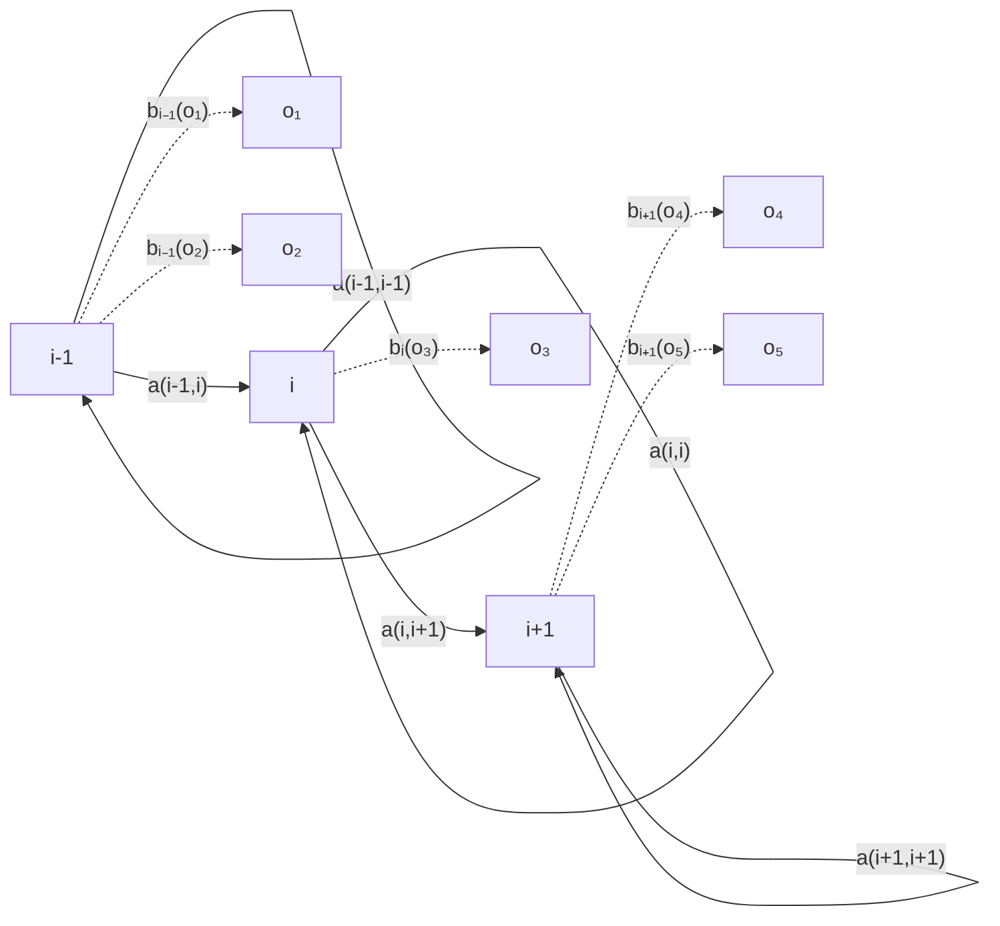
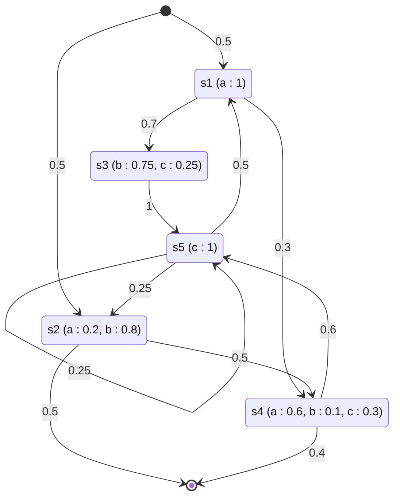

# Algorithme

Le point de vue génératif d'un [[Modèle de Markov caché|modèle de Markov caché]] décrit comment engendrer une suite d'états et la suite d'observations associée à partir de ses [[Paramètres d'un modèle de Markov caché|paramètres]].

1. Choisir l'état initial $s_1$ selon la distribution initiale $\pi$.
2. Tirer un échantillon d'observation selon la loi $b_{s_1}()$.
3. Pour $t = 1, \ldots, T$ :
   - (a) choisir l'état suivant $s_{t+1}$ selon les probabilités de transition
     $$\mathbb{P}[S_{t+1} = j \mid S_t = s_t] = a_{s_t,j}$$
   - (b) tirer un échantillon d'observation selon la loi $b_{s_{t+1}}()$.
4. Fin.

# Interprétation

Le schéma génératif superpose deux niveaux : les états cachés $i-1$, $i$, $i+1$ (une [[Chaîne de Markov à temps discret|chaîne de Markov]] dont chaque état peut rester sur lui-même) et les observations $o_1$ à $o_5$, reliées aux états dont elles sont tirées par les lois d'émission $b$ :

Chaque état émet une observation selon sa propre loi $b$ : $i-1$ émet $o_1$ et $o_2$, $i$ émet $o_3$, $i+1$ émet $o_4$ et $o_5$.

# Exemple

Un modèle à cinq états $s_1$ à $s_5$, d'alphabet d'observation $\mathcal{O} = \{a, b, c\}$. Chaque état est annoté de ses probabilités d'émission ; les flèches portent les probabilités de transition :

Trois trajectoires engendrées par ce modèle, avec leurs probabilités :

| Trajectoire 1 | Trajectoire 2 | Trajectoire 3 |
|---|---|---|
| début | début | début |
| $s_1$ $a$ | $s_1$ $a$ | $s_2$ $a$ |
| $s_3$ $b$ | $s_4$ $b$ | $s_4$ $b$ |
| $s_5$ $c$ | $s_5$ $c$ | $s_5$ $c$ |
| $s_5$ $c$ | $s_5$ $c$ | $s_5$ $c$ |
| $s_5$ $c$ | $s_5$ $c$ | $s_5$ $c$ |
| $s_2$ $b$ | $s_2$ $b$ | $s_2$ $b$ |
| fin | fin | fin |
| $\approx 1.64 \cdot 10^{-3}$ | $\approx 5.6 \cdot 10^{-5}$ | $\approx 1.9 \cdot 10^{-5}$ |

# Remarque

Les probabilités des trajectoires s'obtiennent en multipliant, le long de chaque trajectoire, la probabilité de l'état initial, les probabilités de transition et les probabilités d'émission : on obtient $0.5 \times 0.7 \times 0.75 \times 0.25^3 \times 0.8 \times 0.5 \approx 1.64 \cdot 10^{-3}$ pour la première trajectoire, $\approx 5.6 \cdot 10^{-5}$ pour la deuxième et $\approx 1.9 \cdot 10^{-5}$ pour la troisième. Les valeurs $\approx 4 \cdot 10^{-4}$, $\approx 4.8 \cdot 10^{-5}$ et $\approx 8 \cdot 10^{-6}$ sont erronées : elles ne se déduisent pas du modèle.

Le point de vue génératif s'applique aussi à une chaîne de Markov sans observations, où seule la suite des états est engendrée : voir [[Génération d'une chaîne de Markov]].
