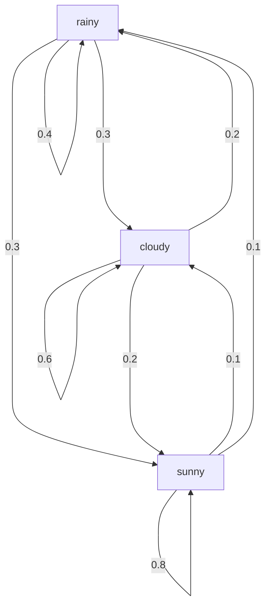

# Algorithme

Le point de vue génératif décrit une [[Chaîne de Markov à temps discret|chaîne de Markov]] comme une procédure d'échantillonnage des états successifs : l'état initial est tiré selon la loi initiale $\pi$, puis chaque nouvel état est tiré selon la loi de transition du seul état courant, conformément à la [[Propriété de Markov]].

1. Tirer l'état initial selon la loi initiale $\pi$.
2. Tirer l'état suivant selon la loi de transition de l'état courant : $\mathbb{P}[X_t = j \mid X_{t-1} = i] = a_{ij}$ pour tout $t$.
3. Répéter l'étape 2 pour chaque nouvel état.

# Exemple

Pour l'exemple météo à trois états (rainy, cloudy, sunny), l'état initial est tiré uniformément, $\pi = \{1/3, 1/3, 1/3\}$, puis chaque état suivant suit les transitions ci-dessous.

Par exemple, si l'état courant est rainy, l'état suivant est rainy avec probabilité 0.4, cloudy avec probabilité 0.3 et sunny avec probabilité 0.3.

# Remarque

La génération se poursuit en répétant le tirage de l'état suivant (étape 2) ; une formulation « répéter l'étape 3 » serait circulaire, l'étape 3 désignant la répétition elle-même.
