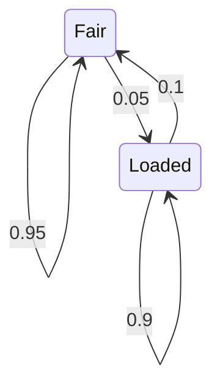

# Définition

Un **modèle de Markov caché** représente deux processus aléatoires :

- le **processus caché** $S = S_1, \dots, S_T$, suite des états d'une [[Chaîne de Markov à temps discret|chaîne de Markov]], avec $S_t \in [1, N]$ ;
- le **processus d'observation** $O = O_1, \dots, O_T$, où la probabilité d'une observation dépend de la suite des états.

Le processus de Markov (son état) n'est pas observable : l'observation est une fonction stochastique dépendant de l'état caché du processus de Markov sous-jacent.

L'observation peut être **discrète ou continue**. Les observations sont supposées **indépendantes** conditionnellement à la suite des états cachés.

# Interprétation

L'état du système n'est jamais connu directement : on n'a accès qu'à des observations qui en dépendent. Pour relier les états non observés aux observations, le modèle ajoute à chaque état une fonction probabiliste.

Ainsi, dans l'exemple météo, le temps qu'il fait n'est pas observé directement ; on ne dispose que de relevés qui en dépendent, comme la température, l'humidité et le vent.

# Exemple

**Les deux dés.** On jette un dé sans savoir lequel : à chaque lancer, c'est l'un des deux (un dé équilibré (*Fair*) et un dé pipé (*Loaded*)) qui est utilisé. L'état caché est le dé utilisé, et l'observation est le résultat affiché.

Le dé utilisé évolue d'un lancer au suivant selon les probabilités de transition suivantes :

Les probabilités d'émission (la probabilité d'obtenir chaque résultat sachant le dé utilisé) sont :

| Dé utilisé | 1 | 2 | 3 | 4 | 5 | 6 |
|---|---|---|---|---|---|---|
| Fair (équilibré) | $1/6$ | $1/6$ | $1/6$ | $1/6$ | $1/6$ | $1/6$ |
| Loaded (pipé) | $1/10$ | $1/10$ | $1/10$ | $1/10$ | $1/10$ | $1/2$ |

Une réalisation possible enchaîne par exemple les états cachés « F F F F L L L L L F F… » avec les observations « 1 6 4 3 6 3 6 6 2 4 2… ».

# Propriétés

Dans le cas discret, un modèle de Markov caché est en fait une [[Chaîne de Markov à temps discret|chaîne de Markov]] : la suite des couples $(x_k, y_k)$ formés d'un état et de l'observation associée est markovienne, puisque

$$\mathbb{P}[x_k \mid x_{k-1}]\,\mathbb{P}[y_k \mid x_k] = \underbrace{\mathbb{P}[y_k, x_k \mid x_{k-1}]}_{a((x_{k-1}, y_{k-1}), (x_k, y_k))}$$

# Remarque

- Voir [[Probabilités d'un modèle de Markov caché]] pour les probabilités associées au modèle et [[Paramètres d'un modèle de Markov caché]] pour ses paramètres.
- La [[Génération d'un modèle de Markov caché]] en décrit le point de vue génératif.
- Le modèle de Markov caché est un cas particulier des [[Modèle à espace d'état|modèles à espace d'état]].
- Comme le [[Variables cachées d'un modèle de mélange|modèle de mélange]], il fait intervenir une variable non observée qui gouverne la loi des observations ; ici, cette variable est une suite d'états régie par une chaîne de Markov.
