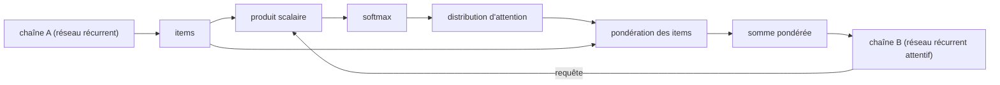

# Modèle

Le **mécanisme d'attention** repose sur un [[Réseau de neurones récurrent|réseau récurrent]] **attentif** : celui-ci génère une **requête** (*query*) décrivant ce sur quoi il veut se focaliser. Chaque **item**, c'est-à-dire chaque état produit par le réseau récurrent sur la séquence, est mis en correspondance avec la requête par un **produit scalaire** ; le résultat est un **score**, qui décrit la qualité de l'appariement de l'item avec la requête. Les scores sont ensuite passés dans un **softmax**, qui crée la **distribution d'attention**.

La distribution d'attention pondère les items, et la somme pondérée obtenue est fournie au réseau récurrent attentif. Le mécanisme fait coopérer deux chaînes de cellules récurrentes : la chaîne $A$ fournit les items, la chaîne $B$ (le réseau récurrent attentif) produit la requête et reçoit la somme pondérée.

# Exemple

En traduction, la distribution d'attention relie les mots de la phrase produite aux mots de la phrase d'entrée qui leur correspondent : la phrase « Economic growth has slowed down in recent years. » se traduit en allemand par « Das Wirtschaftswachstum hat sich in den letzten Jahren verlangsamt. » et en français par « La croissance économique s'est ralentie ces dernières années. »

# Remarque

Le mécanisme d'attention généralise la [[Chaîne de Markov à temps discret]] ; il constitue une alternative au [[Réseau de neurones récurrent]] pour cette généralisation.
