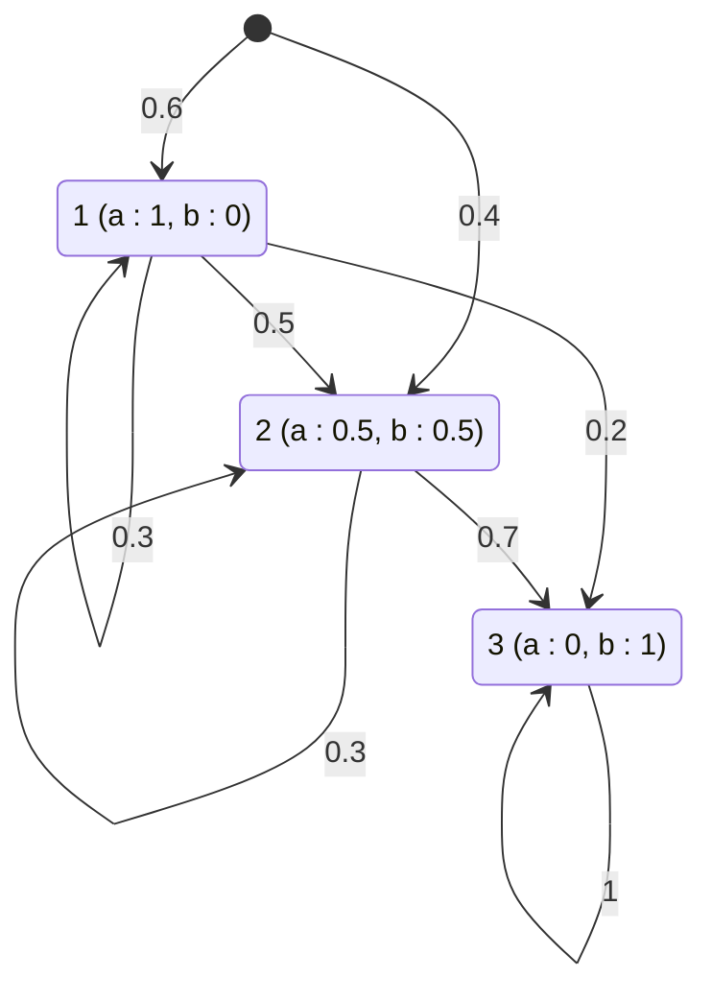

# Définition

Un [[Modèle de Markov caché|modèle de Markov caché]] est décrit par l'ensemble de ses paramètres

$$\text{Modèle} = \lambda_N(\pi, A, B)$$

- nombre d'états du modèle : $N$ ;
- distribution initiale des états : $\pi$ ;
- matrice des probabilités de transition : $A$, où $a_{ij} = \mathbb{P}[S_t = j \mid S_{t-1} = i]$ ;
- densités conditionnelles des états :
  - **modèle de Markov caché discret** : matrice des probabilités conditionnelles $B$, où $b_{ik} = \mathbb{P}[O_t = k \mid S_t = i]$ ;
  - **modèle de Markov caché à densités continues** : ensemble de densités paramétriques conditionnelles $b_i()$ ; en pratique, $b_i()$ est souvent un [[Mélange gaussien|mélange gaussien]].

# Exemple

Soit $\lambda_3 = (A, B, \pi)$ un modèle à trois états $1$, $2$ et $3$, à alphabet de deux symboles d'observation $a$ et $b$ :

$$A = \begin{pmatrix} 0{,}3 & 0{,}5 & 0{,}2 \\ 0 & 0{,}3 & 0{,}7 \\ 0 & 0 & 1 \end{pmatrix}$$

$$B = \begin{pmatrix} 1 & 0 \\ 0{,}5 & 0{,}5 \\ 0 & 1 \end{pmatrix}$$

$$\pi = \begin{pmatrix} 0{,}6 \\ 0{,}4 \\ 0 \end{pmatrix}$$

Chaque ligne de $B$ donne la loi des observations conditionnellement à l'état : l'état $1$ émet toujours le symbole $a$, l'état $3$ toujours le symbole $b$, et l'état $2$ émet $a$ ou $b$ avec la probabilité $0{,}5$.

# Remarque

La suite des états $S_t$ est une [[Chaîne de Markov à temps discret|chaîne de Markov à temps discret]] de matrice de transition $A$ et de loi initiale $\pi$. La loi jointe des états et des observations s'exprime à partir de ces paramètres : voir [[Probabilités d'un modèle de Markov caché]].
