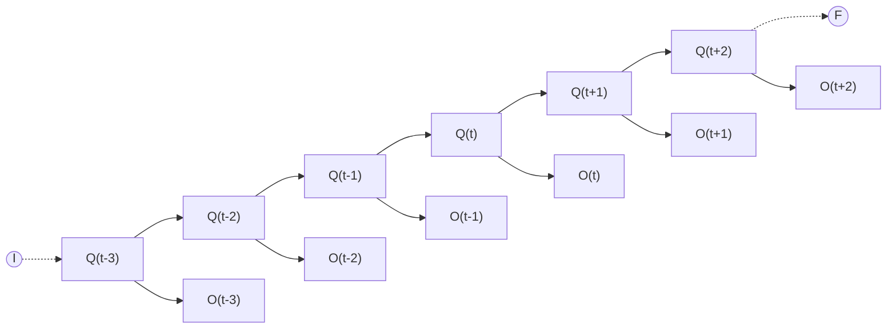

# Loi

Un [[Modèle de Markov caché]] fait intervenir deux séquences : la suite des états cachés $S = s_1, \ldots, s_T$ et la suite des observations $O = o_1, \ldots, o_T$. La **probabilité jointe** des deux séquences s'écrit

$$\mathbb{P}[O = o_1, \ldots, o_T, S = s_1, \ldots, s_T] = \mathbb{P}[O \mid S]\,\mathbb{P}[S].$$

La probabilité de la suite d'états est donnée par une [[Chaîne de Markov à temps discret|chaîne de Markov]] d'ordre 1 : $\pi_{s_1}$ est la probabilité que l'état initial soit $s_1$, et

$$\mathbb{P}[S = s_1, \ldots, s_T] = \pi_{s_1} \prod_{t=2}^{T} \mathbb{P}[s_t \mid s_{t-1}].$$

La probabilité conditionnelle de la suite d'observations découle de l'hypothèse d'[[Indépendance de variables aléatoires|indépendance conditionnelle]] des observations sachant la suite d'états :

$$\mathbb{P}[O = o_1, \ldots, o_T \mid S = s_1, \ldots, s_T] = \prod_{t=1}^{T} \mathbb{P}[o_t \mid s_t].$$

En reportant ces deux expressions dans la probabilité jointe, celle-ci prend la forme développée

$$\mathbb{P}[O = o_1, \ldots, o_T, S = s_1, \ldots, s_T] = \pi_{s_1} \prod_{t=2}^{T} \mathbb{P}[s_t \mid s_{t-1}] \prod_{t=1}^{T} \mathbb{P}[o_t \mid s_t].$$

# Interprétation

La factorisation reflète les deux niveaux du modèle. La suite des états cachés évolue selon une chaîne de Markov : la probabilité d'une suite d'états est celle de son état initial, multipliée par les probabilités de transition successives. La suite des observations suit l'hypothèse d'indépendance conditionnelle : chaque observation $o_t$ ne dépend que de l'état $s_t$ au même instant.

La structure du modèle se représente par une chaîne d'états, de l'état initial $I$ à l'état final $F$, chaque état étant associé à l'observation qui en dépend :

# Remarque

La suite des observations s'écrit $O = o_1, \ldots, o_T$ : elle contient $T$ observations et se termine par l'observation $o_T$. L'écriture $O = o_1, \ldots, T$, qui omet l'observation finale, est une erreur à éviter.

Voir [[Paramètres d'un modèle de Markov caché]] pour la distribution initiale, la matrice de transition et les probabilités d'observation conditionnelles qui apparaissent dans ces formules.
