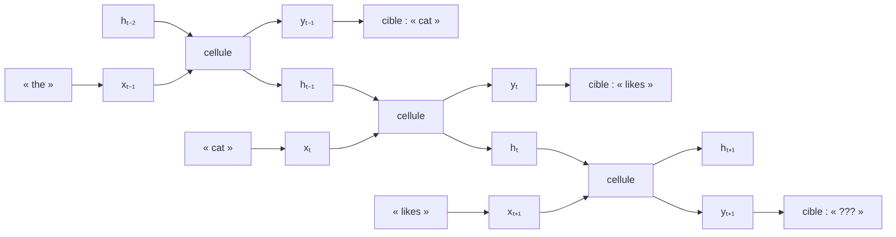

# Modèle

Un **réseau de neurones récurrent** prédit l'état $X_i$ d'un processus en résumant tout son historique dans un vecteur d'**état caché** $h_{i-1}$ :

$$\mathbb{P}[X_i \mid \underbrace{X_{i-1} \cdots X_1}_{\text{historique complet}}] \doteq f(X_i, h_{i-1})$$

Dans un réseau d'**Elman**, l'état caché et la sortie se calculent à chaque pas par

$$
\begin{aligned}
\text{Prédiction d'état} & \quad h_i = \sigma(U_x x_i + U_h h_{i-1}) \\
\text{Prédiction de sortie} & \quad y_i = \operatorname{softmax}(V h_i)
\end{aligned}
$$

où $x_i$ désigne l'entrée au pas $i$, $U_x$, $U_h$ et $V$ les matrices de poids du réseau, et $\sigma$ une fonction d'activation non linéaire.

# Interprétation

Le réseau se déroule dans le temps : à chaque pas, une entrée $x_i$ et l'état caché $h_{i-1}$ du pas précédent produisent la sortie $y_i$ et le nouvel état caché $h_i$, transmis au pas suivant. L'état caché transporte ainsi d'un pas au suivant l'information sur tout l'historique du processus.

L'exemple ci-dessous déroule le réseau sur trois pas d'une prédiction du mot suivant :

Après l'entrée « the », la cible est « cat » ; après l'entrée « cat », la cible est « likes » ; après l'entrée « likes », la cible reste à prédire.

# Remarque

Le réseau de neurones récurrent généralise la [[Chaîne de Markov à temps discret]] : celle-ci conditionne la loi de l'état suivant par le seul état courant, tandis que le réseau résume tout l'historique dans son état caché. Le [[Mécanisme d'attention]] en propose une autre généralisation.
