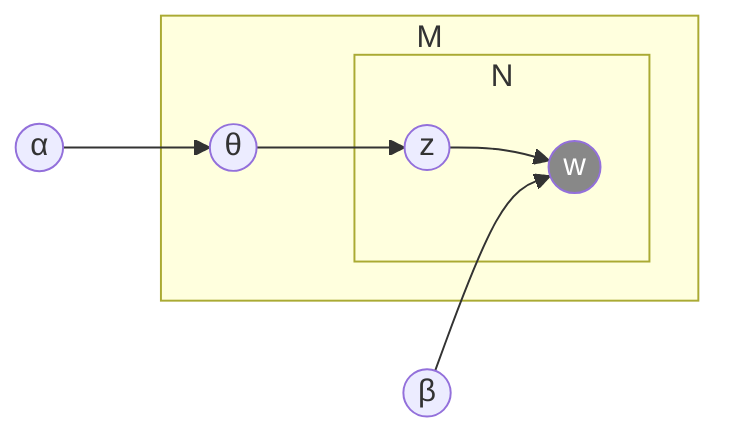

# Définition

L'**allocation de Dirichlet latente** (en anglais *Latent Dirichlet Allocation*, LDA) est un [[Modèles de mélange|modèle de mélange]] appliqué aux textes : un document est décrit comme un mélange de *topics* (thèmes), chaque topic étant une distribution de probabilité sur les mots.

# Exemple

Trois phrases d'exemple :

- *I eat fish and vegetables.*
- *Fishes are pets.*
- *My kitten eats fish.*

Le graphe suivant résume la structure du modèle : les flèches vont de $\alpha$ à $\theta$, de $\theta$ à $z$, de $z$ à $w$ et de $\beta$ à $w$ ; $z$ et $w$ sont regroupés dans une plaque $N$, et $\theta$, $z$ et $w$ dans une plaque $M$.

Quatre des 300 topics extraits du corpus TASA :

**Topic 247**

| mot | prob. |
|------|-------|
| DRUGS | .069 |
| DRUG | .060 |
| MEDICINE | .027 |
| EFFECTS | .026 |
| BODY | .023 |
| MEDICINES | .019 |
| PAIN | .016 |
| PERSON | .016 |
| MARIJUANA | .014 |
| LABEL | .012 |
| ALCOHOL | .012 |
| DANGEROUS | .011 |
| ABUSE | .009 |
| EFFECT | .009 |
| KNOWN | .008 |
| PILLS | .008 |

**Topic 5**

| mot | prob. |
|------|-------|
| RED | .202 |
| BLUE | .099 |
| GREEN | .096 |
| YELLOW | .073 |
| WHITE | .048 |
| COLOR | .048 |
| BRIGHT | .030 |
| COLORS | .029 |
| ORANGE | .027 |
| BROWN | .027 |
| PINK | .017 |
| LOOK | .017 |
| BLACK | .016 |
| PURPLE | .015 |
| CROSS | .011 |
| COLORED | .009 |

**Topic 43**

| mot | prob. |
|------|-------|
| MIND | .081 |
| THOUGHT | .066 |
| REMEMBER | .064 |
| MEMORY | .037 |
| THINKING | .030 |
| PROFESSOR | .028 |
| FELT | .025 |
| REMEMBERED | .022 |
| THOUGHTS | .020 |
| FORGOTTEN | .020 |
| MOMENT | .020 |
| THINK | .019 |
| THING | .016 |
| WONDER | .014 |
| FORGET | .012 |
| RECALL | .012 |

**Topic 56**

| mot | prob. |
|------|-------|
| DOCTOR | .074 |
| DR. | .063 |
| PATIENT | .061 |
| HOSPITAL | .049 |
| CARE | .046 |
| MEDICAL | .042 |
| NURSE | .031 |
| PATIENTS | .029 |
| DOCTORS | .028 |
| HEALTH | .025 |
| MEDICINE | .017 |
| NURSING | .017 |
| DENTAL | .015 |
| NURSES | .013 |
| PHYSICIAN | .012 |
| HOSPITALS | .011 |

# Remarque

L'allocation de Dirichlet latente est un cas particulier des [[Modèles de mélange|modèles de mélange]], appliqué aux textes : chaque composante du mélange y est un topic. Pour dégager les thèmes d'un corpus de textes, elle relève du [[Clustering de textes|clustering de textes]] et des [[Applications du clustering|applications du clustering]].
