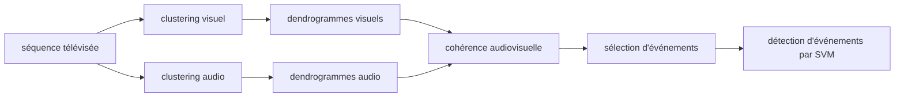

# Définition

Le **clustering ascendant pour le partitionnement temporel** est une application du [[Clustering hiérarchique|clustering hiérarchique]] au découpage d'une séquence temporelle en groupes de segments homogènes.

La séquence est d'abord découpée en segments, puis les segments aux caractéristiques similaires sont regroupés par une construction ascendante ([[Clustering agglomératif et divisif|agglomérative]]). Le résultat se lit sur un dendrogramme, que l'on coupe pour fixer le partitionnement.

# Algorithme

1. **Détecter les frontières des segments**, par des tests d'hypothèses.
2. **Regrouper les segments aux caractéristiques similaires** :
   - représentation des clusters par des modèles : densités gaussiennes et mélanges ;
   - comparaison par la divergence de Kullback-Leibler et le rapport de vraisemblance généralisé.
3. **Déterminer où couper le dendrogramme**, par une approche de sélection de modèle : le critère d'information bayésien.

# Exemple

Un dendrogramme dont les feuilles correspondent aux segments de la séquence est coupé par un trait horizontal en pointillés : les segments d'un même groupe apparaissent alors d'une même couleur sur la séquence, plusieurs segments rouges successifs, plusieurs segments verts, un segment bleu isolé.

La fouille de séquences télévisées, exemple d'[[Applications du clustering|application du clustering]] : la séquence est analysée séparément sur les images (clustering visuel) et sur le son (clustering audio), puis les regroupements des deux analyses sont confrontés par une étape de cohérence audiovisuelle ; une sélection d'événements et une détection d'événements par SVM complètent la chaîne.

