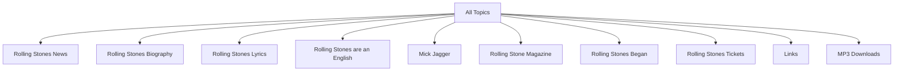

# Définition

Le **clustering de textes** applique le [[Clustering|clustering]] à des documents textuels : il regroupe automatiquement ces documents en thèmes apparentés. C'est l'une des [[Applications du clustering|applications du clustering]].

# Exemple

Une recherche sur **rolling stones** regroupe ses résultats sous un thème racine (« All Topics ») et une série de thèmes :

Chaque thème est accompagné du nombre de documents qui lui est associé. Sélectionner un thème (ici « Rolling Stones Biography ») affiche dans un volet les documents qu'il contient, chacun présenté avec son titre, un extrait et son adresse ; un lien « show all » déroule la suite des thèmes.
