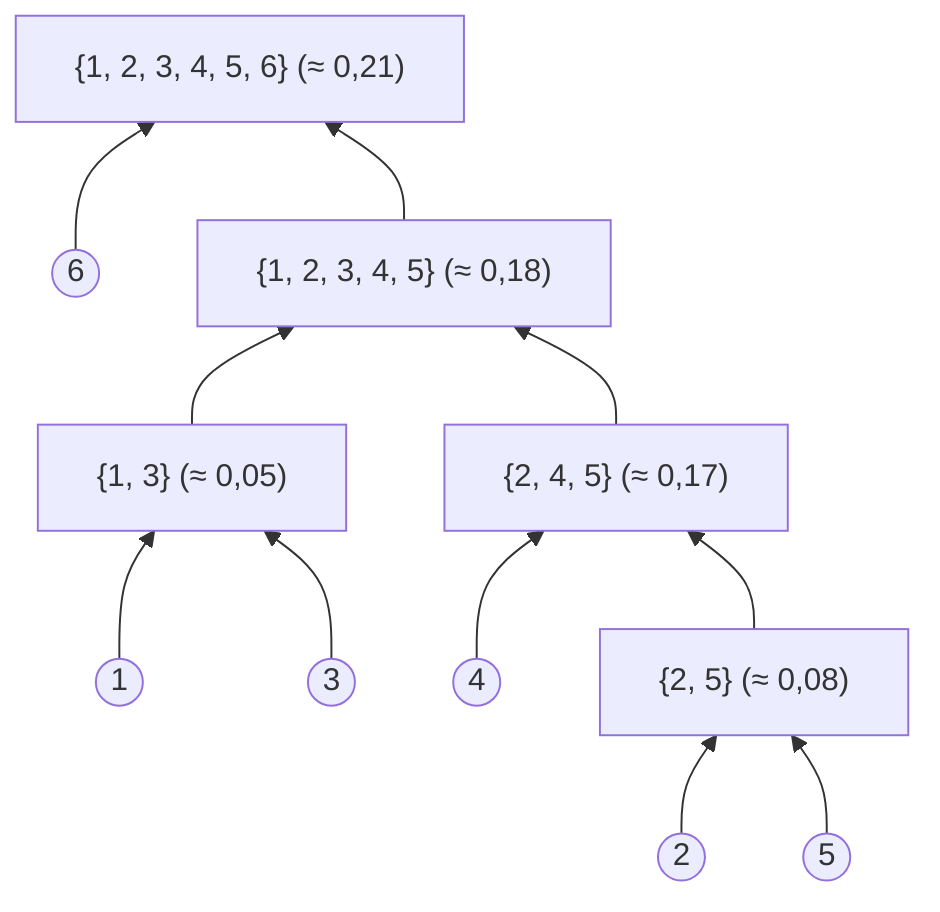

# Définition

Le **clustering hiérarchique** est une approche de [[Clustering|clustering]] qui génère progressivement des clusters en fusionnant ou en divisant les données.

# Interprétation

Les regroupements successifs produisent des **clusters imbriqués** : un cluster peut contenir des sous-clusters et être lui-même contenu dans un cluster plus vaste, formant une hiérarchie de clusters emboîtés.

Le résultat se visualise sous forme de **dendrogramme**, un arbre qui représente les regroupements successifs des objets.

# Exemple

Exemple de dendrogramme sur six points numérotés de 1 à 6 :

Niveaux de fusion approximatifs, relevés sur le dendrogramme.

La même hiérarchie peut se représenter en régions emboîtées : $\{1, 3\} \subset \{1, 2, 3, 4, 5\} \subset \{1, 2, 3, 4, 5, 6\}$, et $\{2, 5\} \subset \{2, 4, 5\} \subset \{1, 2, 3, 4, 5\}$ ; le point 6 n'apparaît qu'au dernier regroupement.

# Remarque

Les deux constructions de la hiérarchie, par fusions ou divisions successives, sont détaillées dans [[Clustering agglomératif et divisif]] ; la mesure de proximité entre clusters utilisée pour choisir les fusions est décrite dans [[Types de liaison entre clusters]]. Le [[Clustering ascendant pour le partitionnement temporel|partitionnement temporel]] en est une application.
