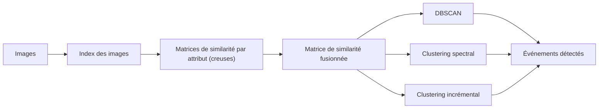

# Définition

La **détection d'événements sociaux** est une application du [[Clustering|clustering]] : elle consiste à regrouper des images partagées sur les réseaux sociaux selon l'événement social qu'elles documentent. Elle compte parmi les [[Applications du clustering]].

# Exemple

La tâche de détection d'événements sociaux de MediaEval 2013 combine la similarité creuse entre médias, le [[DBSCAN|clustering par densité]], le [[Clustering spectral|clustering spectral]] et le traitement incrémental.

**Approche générale.** Les images sont indexées, comparées par des matrices de similarité creuses, puis regroupées ; les groupes obtenus constituent les événements détectés :

**Similarité entre médias.** La similarité est construite de façon creuse :

- un index Lucene de toutes les images à regrouper est construit ; une requête est posée pour chaque image, et seuls les résultats retournés servent à l'étape suivante ;
- des attributs sont extraits pour chaque image (temps de prise, temps de publication, lieu, description, titre, étiquettes) et des [[Mesures de similarité et de distance|mesures de distance]] personnalisées servent à calculer la similarité de deux images ; on obtient une matrice de similarité par attribut ;
- ces matrices sont pondérées par des poids appris, puis additionnées en une unique matrice de similarité fusionnée, prête pour le clustering.

**Clustering.** Deux algorithmes sont utilisés :

- [[DBSCAN]] : il trouve les données mutuellement connectées par densité et identifie comme bruit celles qui ne le sont pas ; il travaille directement sur la matrice de similarité fusionnée ;
- le [[Clustering spectral|clustering spectral]] : il calcule, à partir de la matrice de similarité, le [[Laplacien du graphe|laplacien]] d'un graphe, dont les vecteurs propres des petites valeurs propres forment un espace dans lequel un autre algorithme de clustering regroupe mieux les données ; ici, c'est DBSCAN qui est appliqué dans cet espace.

**Traitement incrémental.** Les médias arrivent progressivement ; plutôt que de tout regrouper à chaque fois, le traitement procède par fenêtres :

1. regrouper la fenêtre initiale ;
2. agrandir la fenêtre, regrouper à nouveau ;
3. identifier les clusters stables ;
4. poursuivre en ignorant les clusters stables.

Ce traitement par fenêtres temporelles que l'on agrandit s'apparente au [[Clustering ascendant pour le partitionnement temporel]].

**Résultats.** Une recherche sur le simplexe a servi à trouver la meilleure pondération des attributs ; les différences entre les 1 000 meilleurs points du simplexe étant faibles, une pondération moyenne combinant ces 1 000 meilleurs poids a également été utilisée :

| Pondération | Temps de prise | Temps de publication | Lieu | Description | Titre | Étiquettes |
|---|---|---|---|---|---|---|
| Meilleure | 2 | 0 | 1 | 1 | 0 | 3 |
| Moyenne | 2,1 | 1,8 | 1,4 | 0,7 | 0,3 | 1,7 |

Dans tous les réglages soumis, l'algorithme incrémental a été utilisé ; la technique incrémentale a permis d'appliquer le clustering spectral à un jeu de données relativement grand, mais c'est DBSCAN qui s'est montré globalement le meilleur. Avec la meilleure pondération, la F1 vaut 0,945 pour DBSCAN contre 0,911 pour le spectral, et 0,946 contre 0,902 avec la pondération moyenne ; l'indice NMI vaut 0,985 contre 0,977, puis 0,985 contre 0,974.
