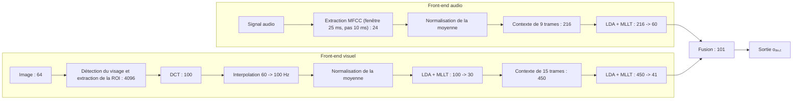

# Définition

L'**analyse discriminante linéaire** (LDA) cherche une projection linéaire des données $X$ dans un sous-espace de dimension plus petite qui :

1. maximise la dispersion entre les classes ;
2. minimise la dispersion à l'intérieur des classes.

# Interprétation

Une même famille de classes peut être projetée selon différentes directions : certaines projections laissent les classes se recouvrir, d'autres les séparent. L'analyse discriminante linéaire retient la projection qui sépare le mieux les classes, en tenant compte de la dispersion des observations à l'intérieur de chacune. Elle est adaptée lorsque les individus appartiennent à des classes connues et que l'objectif est de les séparer au mieux plutôt que de résumer la variance globale.

Comme l'[[Analyse en composantes principales]] et les autres méthodes de [[Projection et clustering|projection]], elle ramène les données à un sous-espace de dimension plus petite ; sa spécificité est d'exploiter l'appartenance des observations à des classes.

# Propriétés

Soient $K$ classes de $n_i$ échantillons chacune, de moyenne respective $\mu_i$, et soit $\mu$ la moyenne de l'ensemble des échantillons. On définit :

- la **matrice de dispersion intra-classes** : $\mathbf{S}_w = \sum_{i=1}^K \sum_{j=1}^{n_i} (x_{ij} - \mu_i)(x_{ij} - \mu_i)^\top$ ;
- la **matrice de dispersion inter-classes** : $\mathbf{S}_b = \sum_{i=1}^K (\mu_i - \mu)(\mu_i - \mu)^\top$.

On cherche la projection $\mathbf{y} = \mathbf{U}\mathbf{x}$ qui maximise

$$\max_{\mathbf{U}} \frac{|\mathbf{U}^\top\mathbf{S}_b\mathbf{U}|}{|\mathbf{U}^\top\mathbf{S}_w\mathbf{U}|}$$

La solution est donnée par le système propre généralisé

$$\mathbf{S}_b\mathbf{u}_k = \lambda_k\mathbf{S}_w\mathbf{u}_k$$

# Remarque

Le cas à deux classes est équivalent au [[Discriminant linéaire de Fisher]], sous les hypothèses que la distribution a posteriori $p(\mathbf{x}_i|\text{classe})$ est gaussienne et que les deux classes sont homoscédastiques, c'est-à-dire de même matrice de covariance :

$$\Sigma_0 = \Sigma_1 = \Sigma$$

# Exemple

## LDA comme front-end pour la reconnaissance audiovisuelle de la parole

L'analyse discriminante linéaire est utilisée comme étape de réduction de dimension (*front-end*) dans un système de reconnaissance automatique de la parole audiovisuelle. Les traits acoustiques et visuels sont extraits séparément, normalisés, puis la dimension de chaque flux est réduite par des étages **LDA + MLLT** (un seul étage pour le flux acoustique, deux étages successifs pour le flux visuel) avant la fusion des deux :

La chaîne visuelle est traitée à 60 Hz puis interpolée à 100 Hz. Le vecteur audiovisuel $\mathbf{o}_{av,t}$, de 101 coefficients, est obtenu par la fusion des étages LDA des deux flux.
