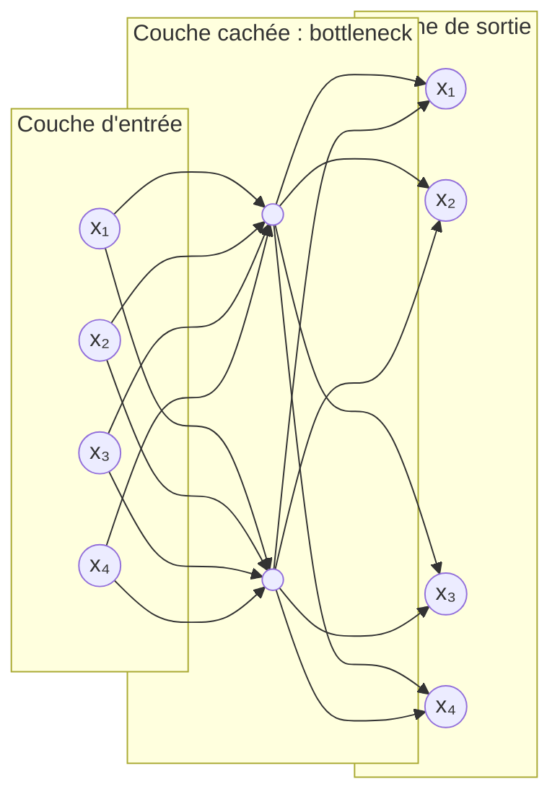

# Interprétation

La [[Projection linéaire des données|projection linéaire]] $y = Ux$ obtenue par un système propre sert à :

- maximiser la variance des données projetées, avec l'[[Analyse en composantes principales|analyse en composantes principales]] ;
- maximiser la discrimination entre classes, avec l'[[Analyse discriminante linéaire|analyse discriminante linéaire]].

D'autres approches vont au-delà :

- des formes plus complexes de $U$ : la **NMF** (factorisation en matrices non négatives) et l'**ICA** (analyse en composantes indépendantes) ;
- des **transformations non linéaires** : l'emploi de **noyaux** (astuce du noyau, *kernel trick*) et les **réseaux de neurones artificiels** (perceptron multicouche) ;
- les **cartes auto-organisatrices** (*self-organizing maps*).

# Exemple

Un réseau de neurones à couche cachée réduite (un *bottleneck*, ou goulot d'étranglement) réalise une transformation non linéaire :

Chaque neurone de la couche d'entrée est relié à chacun des deux neurones de la couche cachée, et chacun de ces deux neurones à chacun des quatre neurones de la couche de sortie.

# Remarque

Pour une autre approche de réduction de dimension, voir l'[[Analyse factorielle]].
